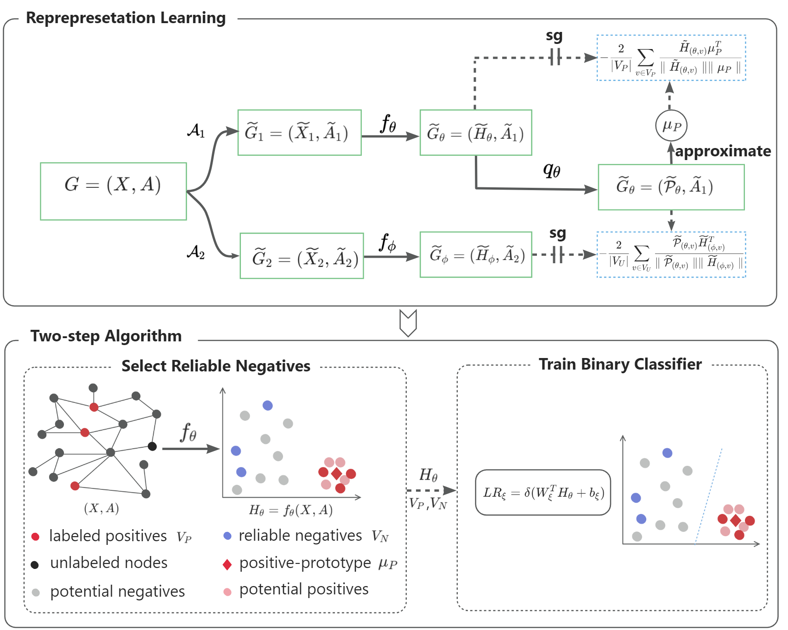

 Bootstrap Latent Prototypes for Graph Positive-Unlabeled Learning
====
This repository is an implementation of a novel method for graph positive and unlabeled learning: Bootstrap Latent Prototypes for Graph Positive-Unlabeled Learning

##Main ideas
<p align="left">
  
<p align="left"><em>Overview of BLP framework. Upper panel: the BLP representation learning module trains its main encoder $ f_{\theta} $ by minimizing similarity losses between the predicted positive-prototype $ \mu_{P} $ and previous representations of positive nodes in $ \widetilde{H}_{\theta} $, as well as between predicted self-prototype $ \widetilde{P}_{\theta} $ and previous representations of unlabeled nodes in $ \widetilde{H}_{\phi} $, where $ \theta $ and $ \phi $ are learnable parameters. The parameter  $ \phi $ of auxiliary encoder $ f_{\phi} $ is updated by a moving average of $ \theta $. Here, \textbf{sg} means stop-gradient. Lower panel: the two-step algorithm utilizes the learned representations $ H_{\theta}$ of nodes and positive-prototype $ \mu_{P} $ to select reliable negative nodes $ V_{N} $. Subsequently, it trains a linear classifier $ LR_{\xi}=\delta(W_{\xi}^{T}H_{\theta}+b_{\xi}) $  with frozen $ H_{\theta}$ as input, and $ V_{P} $ and $ V_{N} $ as supervision, where $ \xi $ is a learnable parameter.</em>
</p>

## Requirements
  * numpy==1.24.3
  * scikit_learn==1.3.1
  * torch==2.0.1
  * torch_geometric==2.3.0
## Usage
run BLP demo by:
```python run_BLP -d 'amazon-photos' -c 2 ```

where -d represents the used dataset, and -c denotes the index of label to be used as positive
## Change Log
```
To be updated
```
## References
```
To be updated
```


